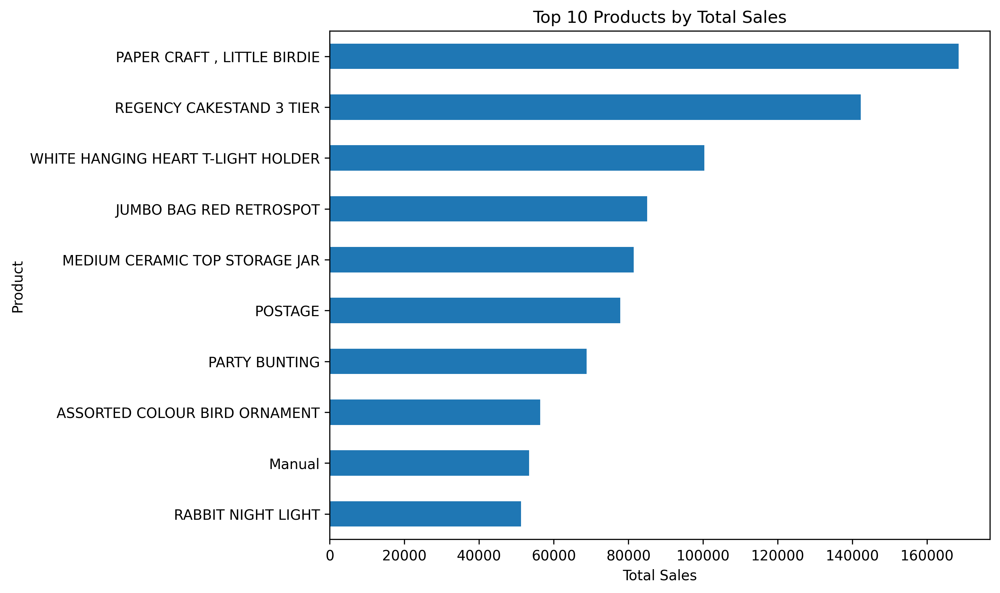
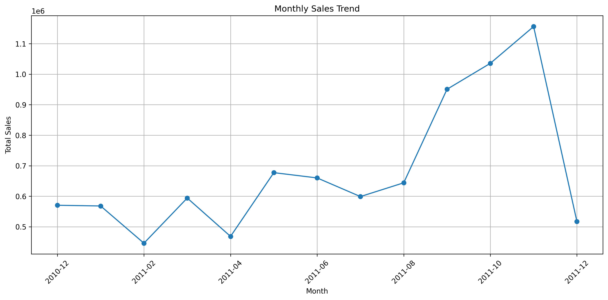
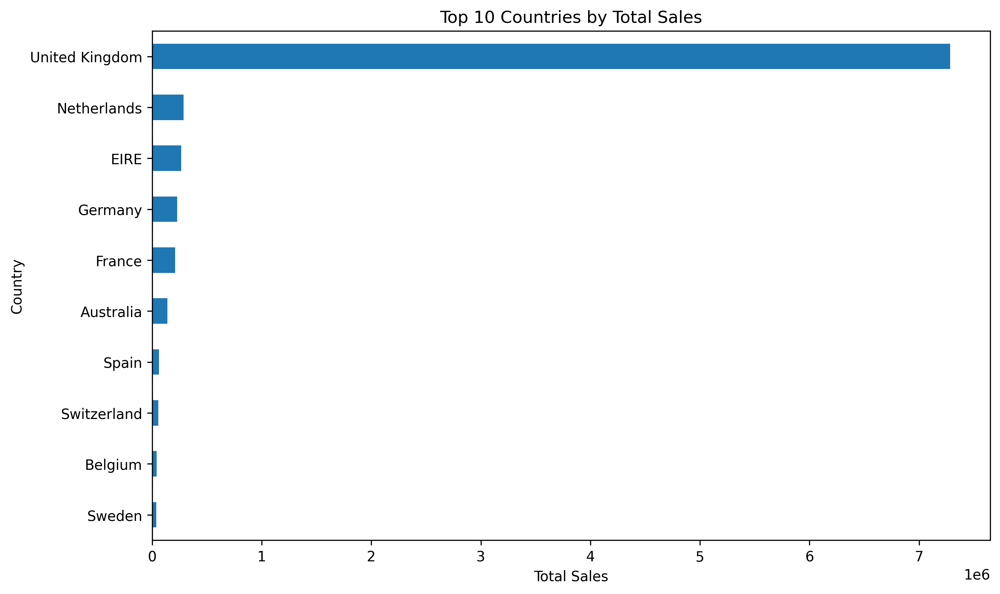
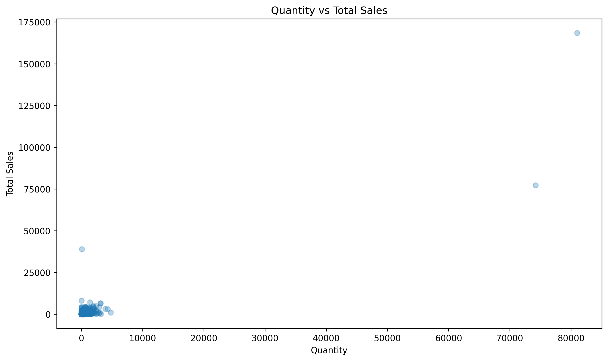
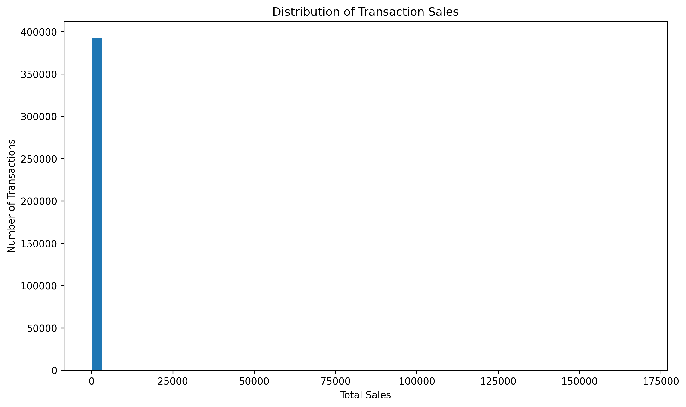
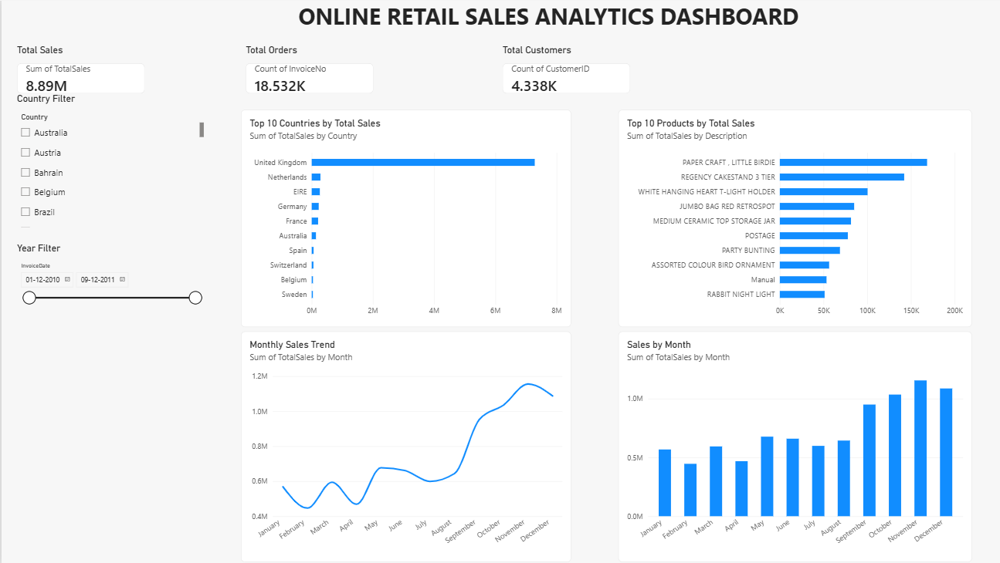

# Sales Data Analytics Project

## 1. Project Overview

This project analyzes real-world online retail transaction data to identify sales trends, top-performing products, major markets, and business opportunities.

The project demonstrates a complete data analytics workflow using Python, Exploratory Data Analysis (EDA), data visualization, Power BI, Git, and GitHub.

## 2. Problem Statement

The objective of this project is to analyze online retail transaction data and answer important business questions such as:

- Which products generate the highest sales?
- Which countries contribute the most revenue?
- How do sales change over time?
- What patterns exist between quantity and sales?
- What recommendations can be made to improve sales planning and business performance?

## 3. Dataset

The project uses the **UCI Online Retail Dataset**, a real-world transaction dataset containing online retail purchases.

### Dataset Details

- Original records: 541,909
- Columns: 8
- Time period: December 2010 to December 2011
- Country: Mainly United Kingdom with international transactions

### Columns

- InvoiceNo
- StockCode
- Description
- Quantity
- InvoiceDate
- UnitPrice
- CustomerID
- Country

## 4. Tools and Technologies

- Python
- Pandas
- Matplotlib
- Google Colab
- Power BI
- Git
- GitHub

## 5. Data Cleaning and Preparation

The dataset was cleaned and prepared using Python and Pandas.

The following steps were performed:

1. Removed duplicate records.
2. Removed records with missing product descriptions.
3. Removed records with missing CustomerID values.
4. Removed transactions with non-positive quantities.
5. Removed transactions with non-positive unit prices.
6. Converted CustomerID to integer format.
7. Created a new `TotalSales` column.

The TotalSales value was calculated as:

`TotalSales = Quantity × UnitPrice`

### Cleaning Result

- Original records: 541,909
- Final cleaned records: 392,692
- Duplicate records remaining: 0
- Missing values in important fields: handled

## 6. Exploratory Data Analysis

Exploratory Data Analysis was performed to understand the dataset and identify important business patterns.

### Descriptive Statistics

Important results from the cleaned dataset include:

- Total Sales: approximately £8.89 million
- Total Orders: 18,532
- Total Customers: 4,338
- Average Order Value: approximately £479.56

### Correlation Analysis

The correlation analysis showed:

- Quantity vs TotalSales: 0.914
- Quantity vs UnitPrice: -0.005
- UnitPrice vs TotalSales: 0.082

The strong positive relationship between Quantity and TotalSales indicates that transaction quantity has a major influence on sales value.

### Sales by Country

The United Kingdom generated the highest sales, with approximately £7.29 million.

Other strong markets included:

- Netherlands
- EIRE
- Germany
- France
- Australia

### Monthly Sales Analysis

Sales increased significantly toward the end of 2011.

The highest monthly sales were:

- November 2011: approximately £1.16 million
- October 2011: approximately £1.04 million
- September 2011: approximately £950.69K

### Outlier Handling

Statistical analysis identified extreme values in Quantity, UnitPrice, and TotalSales.

These values were reviewed rather than automatically removed because some extreme transactions may represent genuine high-volume or high-value purchases.

Invalid non-positive quantities and prices were already removed during data cleaning.

## 7. Data Visualizations

The following visualizations were created using Python and Matplotlib:

### Top 10 Products by Total Sales

### Monthly Sales Trend

### Top 10 Countries by Total Sales

### Quantity vs Total Sales

### Sales Distribution

These visualizations were used to identify sales trends, product performance, market performance, relationships, and transaction distributions.

## 8. Power BI Dashboard

An interactive Power BI dashboard was created to present the key business metrics and trends.

### KPI Cards

- Total Sales: £8.89M
- Total Orders: 18.53K
- Total Customers: 4.34K

### Power BI Visuals

The dashboard includes:

- Monthly Sales Trend
- Top 10 Products by Total Sales
- Top 10 Countries by Total Sales
- Sales by Month

### Filters

The dashboard includes:

- Country Filter
- Year Filter

### Live Power BI Dashboard

[View the Interactive Power BI Dashboard](https://app.powerbi.com/groups/65ccc28f-0131-49cb-8b8b-34510d346ca1/reports/612084f3-4577-4ac2-8e6b-c49b9116177b?ctid=4ce8fa72-23e2-4b0c-b5e0-847fff441edd&pbi_source=linkShare&bookmarkGuid=ab6968ef-41e8-4677-bc2a-af3210a7e3ca)

### Dashboard Preview

The dashboard provides an interactive way to explore sales performance and business trends.

## 9. Insights and Recommendations

### Key Insights

1. The United Kingdom generated the highest total sales, contributing approximately £7.29 million.
2. November 2011 recorded the highest monthly sales at approximately £1.16 million.
3. October 2011 was another strong sales month, generating approximately £1.04 million.
4. PAPER CRAFT, LITTLE BIRDIE was the top-selling product by total sales, generating approximately £168.47K.
5. The cleaned dataset generated approximately £8.89 million in total sales from 18,532 orders and 4,338 unique customers.

### Recommendations

1. Focus marketing and inventory planning on high-performing products and major markets, particularly the United Kingdom.
2. Prepare additional inventory and promotional campaigns before the high-demand period from September to November to take advantage of the seasonal increase in sales.

## 10. Conclusion

The analysis demonstrates how Python, Exploratory Data Analysis, data visualization, and Power BI can be combined to transform raw retail transaction data into meaningful business insights.

The results show strong sales concentration in the United Kingdom, high performance from selected products, and a significant increase in sales toward the end of 2011.

These insights can support better inventory planning, marketing decisions, and sales forecasting.

## Project Files

- `Online Retail.xlsx` — Original dataset
- `Sales_Data_Analytics.ipynb` — Python analysis and EDA notebook
- `Sales_Data_Analytics.pbix` — Power BI dashboard
- `README.md` — Project documentation
- `project_notes.text` — Project notes
- `powerbi_dashboard.png` — Power BI dashboard screenshot
- `top_10_products.png` — Top 10 products visualization
- `top_10_countries.png` — Top 10 countries visualization
- `monthly_sales_trend.png` — Monthly sales trend visualization
- `quantity_vs_sales.png` — Quantity vs sales visualization
- `sales_distribution.png` — Sales distribution visualization
- `Sales_Data_Analytics_Stylish_Presentation.pptx` — Final project presentation
